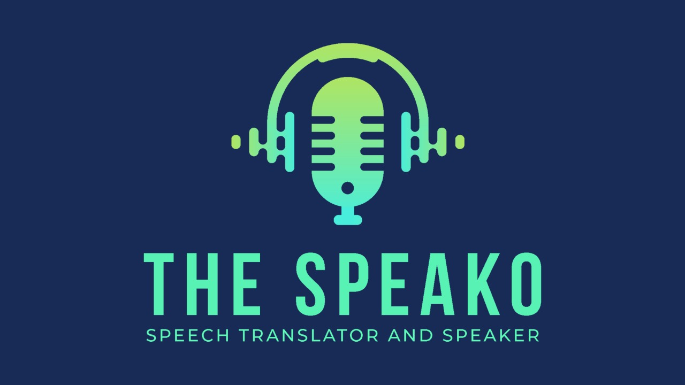

## 🚀 About Project 
------------
Speech recognition, also known as automatic speech recognition (ASR), computer speech recognition, or speech-to-text, is a capability which enables a program to process human speech into a written format. The Speako is a Natural Language Processing based project built on top of stack of technologies in order to transcribe the **English** **voice** based audio files of any accent. The project further provides the facility to user to provide the **Urdu** **Translation** of that transcribed text. Lastly, it also extracts **Keywords** from that transcribed text.

#### Features:
------------

- 🤩 This project will let the users to transcribe there `.flac` or `.wav` **audio** file.
- 🥳 Translate the transcribtion into Urdu Language.
- 😋 Extract the Key points of text.

## 📂 Project Organization
------------

    ├── LICENSE
    ├── Makefile           <- Makefile with commands like `make data` or `make train`
    ├── README.md          <- The top-level README for developers using this project.
    ├── data
    │   ├── external       <- Data from third party sources.
    │   ├── interim        <- Intermediate data that has been transformed.
    │   ├── processed      <- The final, canonical data sets for modeling.
    │   └── raw            <- The original, immutable data dump.
    │
    ├── docs               <- A default Sphinx project; see sphinx-doc.org for details
    │
    │
    ├── notebooks          <- Jupyter notebooks. Naming convention is a number (for ordering),
    │                         the creator's initials, and a short `-` delimited description, e.g.
    │                         `1.0-jqp-initial-data-exploration`.
    │
    ├── requirements.txt   <- The requirements file for reproducing the analysis environment, e.g.
    │                         generated with `pip freeze > requirements.txt`
    │
    ├── src                <- Source code for use in this project.
    │   ├── __init__.py    <- Makes src a Python module
    │   │
    │   ├── data           <- Scripts to download or generate data
    │   │   └── make_dataset.py
    │   │
    │   ├── features       <- Scripts to turn raw data into features for modeling
    │   │   └── build_features.py
    │   │
    │   ├── models         <- Scripts to train models and then use trained models to make
    │   │   │                 predictions
    │   │   ├── predict_model.py
    │   │   └── train_model.py
    │   │
    │   └── visualization  <- Scripts to create exploratory and results oriented visualizations
    │       └── visualize.py
    │
    └── tox.ini            <- tox file with settings for running tox; see tox.readthedocs.io

## 📃 Transcription
------------

### Model Selection Steps:

We selected four accurate working Transcription Models and peform evaluation to select the best performer among four of them.
- Facebook/wav2vec2-large-960h-lv60-self
- Facebook/wav2vec2-lv60-base
- Pytorch transformers model
- Deep search model by Mozilla

####  📈 Dataset:
- Audio clips of different `English` accents were collected several online resources.

#### 🔩 Preprocessing Step:
- Sampled the Audio file at 16 KHz
- Removed any distortion or background noises from the audio

#### 💭Evaluation:
These are the following evaluation metrics which were considered to select the best working model.
- Word Error Rate for each model
- Match Error Rate for each model
- Word Information Loss for each model
- Word Error Rate for each accent
- Match Error Rate for each accent
- Word Information Loss for each accent

All the evaualtion results and `meta-data` are logged in __Neptune__ __AI__

### Fine-Tuning Steps:
####  📈 Dataset:
- TIMIT:  is a corpus of phonemically and lexically transcribed speech of American English speakers of different genders and dialects.
#### 🔩 Preprocessing Step:
- Removed irrelivant features from English dataset.In our dataset: `phonetic_detail` ,  `word_detail`, `dialect_region`, `sentence_type`, `speaker_id`)
- Removed expressions like  \ , \ ? \ . \ ! \ - \ ; \ : \ "
- Sampled the Audio file at 16 KHz
#### 💭Evaluation:
- Use WER (Word Error Rate)
#### 🎶 Training:
- TRANSFORMER: We use <a href="https://huggingface.co/docs/transformers/index#:~:text=to%20get%20started-,%F0%9F%A4%97%20Transformers,training%20a%20model%20from%20scratch.">Transformers</a> from huggnig face. 

- Model Used: [facebook/wav2vec2-large-960h-lv60-self](https://huggingface.co/facebook/wav2vec2-large-960h-lv60-self)

## 🔤 Translation
------------
#### Supported Language: 
URDU
- Translates the transcription into __Urdu__ __Language__.
-  Model Used: [Helsinki-NLP/opus-mt-en-ur](https://huggingface.co/Helsinki-NLP/opus-mt-en-ur)
-  In future we will be adding a Pipeline channel to preprocess and generate direct results from it

## 📌 Keywords Extraction
------------
- Text analysis feature that automatically extracts the most used important words from a transciption. It helps summarize the content of texts and recognize the main topics discussed.
- Model Used: [KeyBERT](https://maartengr.github.io/KeyBERT/)

## 🔮 User Interface
------------
- The UI of the project is built using Streamlit.
- It provides a responsive GUI presenation of the project with their respective model `results`.

## 🏭 Project Pipelining
------------
 - Inference Pipeline using [ZenML]("https://zenml.io/home")
 - Fine Tuning Pipeline for English ASR with Transformers

## 🏡 Developer Setup Guide
------------

#### ⏮️ Prerequisites
- Account on <a href="https://streamlit.io/">Stremlit</a>
- <a href="https://docs.docker.com/get-started/">Docker</a> Setup 

You can run Docker image on your local system using

    `docker pull taserx/speako:latest`

    `docker run -p 8501:8501 taserx/speako:latest`

    `docker exec -it <container_name> bash`

    `apt-get update && apt-get install libsndfile1`
    
 For python file:
 
     `python app.py'

## ⚒️ Built Upon
------------

    - Python
    - facebook/wav2vec2-large-960h-lv60-self
    - Helsinki-NLP/opus-mt-en-ur
    - KeyBERT
    - Streamlit
    - Docker
    
## 🔧 Tools Used
------------

    - Visual Studio Code
    - Google Colaboratory
    - Google Drive Mount
    - Neptune AI
    
## 📋 License
------------

This project is licensed under the [MIT](https://choosealicense.com/licenses/mit/) License - see the `LICENSE` file for details.

